# Hi, I'm Ilan



I mostly write systems code — embedded C on microcontrollers, Rust renderers — and build tools for things I actually use.

<!-- Add a line or two here in your own words: who you are, where you're at. -->

## Now building

```console
$ ilan --now
▸ lilota      ULP coprocessor work — wake-on-Nth-press, deep-sleep loop retention
▸ claude-os   read-only operator console for a multi-tool AI stack
▸ next        <!-- fill this in when it changes -->
```

## Build log

<!-- Newest first. Add an entry each time you ship something. -->

### 2026

<details>
<summary><b>Aug</b> — <b>Claude OS</b> · one-page operator console for an AI tool stack</summary>

<br>

Reads what's already on disk — Claude Code, Codex, OpenRouter, Pinecone, Obsidian — and renders one scrollable dashboard: subscriptions, token spend, skills ROI, a 3D memory graph, and a daily prescription engine that names the four highest-impact things to fix. Read-only by design; it never writes to a source tool's data directory.

**New to me here:** three.js force graphs, and designing something whose entire value is that it *doesn't* mutate the data it reads.

`React` · `TypeScript` · `Vite` · `three.js`

</details>

<details>
<summary><b>Aug</b> — <b>Ratio</b> · local-first Chrome side panel for Instagram review</summary>

<br>

Loads followers and following in parallel, verifies the signed-in account matches the one requested, and walks you through non-followers one at a time. Every decision is stored locally against stable Instagram account IDs — no password, no relationship data, no server.

**New to me here:** Chrome's side panel API, and building a keyboard-first review loop (number keys, undo, deferred queue) that stays fast over hundreds of accounts.

`TypeScript` · `Chrome Extensions`

→ [ratio-instagram-follower-filter](https://github.com/IlanG479/ratio-instagram-follower-filter)

</details>

<details>
<summary><b>Jul–Aug</b> — <b>Lilota</b> · embedded runtime research @ Stony Brook COMPAS Lab</summary>

<br>

Lilota — *Little Interpreted Language Over The Air* — is a Tcl-like interpreter for microcontrollers, so a device stays inspectable and scriptable after it's flashed. Low-level mechanisms in C, device policy in Lil/Tcl scripts.

26 commits, concentrated in the ESP32 ULP coprocessor layer: waking from deep sleep after N debounced button presses, retaining deep-sleep loops across wake, and restructuring the RTC clock into `rtctime` / `tzset` subcommands so time survives a power-down. Some work also landed on the RP2040 and ESP8266 ports.

**New to me here:** writing for a coprocessor that runs while the main CPU is asleep — a context where you get a few hundred bytes and no allocator.

`C` · `ESP-IDF` · `ESP32 ULP` · `RP2040`

</details>

<details>
<summary><b>Jul</b> — <b>Vibecraft</b> · native Rust voxel engine (CSIRE side project)</summary>

<br>

A Minecraft-like engine written from scratch in Rust against a `wgpu` renderer — procedural terrain, lighting, block interaction, inventory, survival values, native persistence, commands, and audio. Targets Java Edition 1.21.1 gameplay and assets without being protocol- or NBT-compatible.

Built alongside [@bobz5460](https://github.com/bobz5460) and [@dac63701](https://github.com/dac63701) during CSIRE.

<!-- Describe your own role here in one line — I don't want to guess at it. -->

`Rust` · `wgpu` · `winit` · `nalgebra`

→ [bobz5460/vibecraft](https://github.com/bobz5460/vibecraft)

</details>

### 2025

<details>
<summary><b>Rove</b> · flight search & synthetic routing (HUVTSP team project)</summary>

<br>

A FastAPI service over the Amadeus API doing route optimization with intelligent layover selection, plus a redemption-value calculator comparing flights, hotels, and gift cards. Direct, 1-stop, and 2-stop synthetic route generation.

<!-- Add the higher-level work you did on this recently. -->

`Python` · `FastAPI` · `Amadeus API`

MIT · © 2025 Dominik · built by the Rove Development Team

</details>

## Stack


## GitHub stats

<p>
  
  
</p>

<picture>
  <source media="(prefers-color-scheme: dark)" srcset="https://raw.githubusercontent.com/IlanG479/IlanG479/output/snake-dark.svg" />
  
</picture>

## Connect

[](mailto:ilan.gunawardena@gmail.com)
